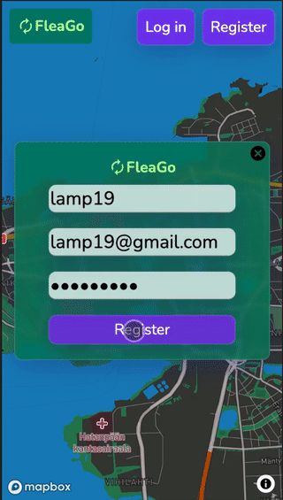

# fleeGo
  
## 2rd place, Decarbonising The Cities Hackathon 2022 (Tampere, Finland)  
There is a big culture for reuse of items in Nordic countries.  
The encouragement to buy used items around the world is lower than it should be,  
for items that still have plenty more to give.  
Our solution for decarbonizing cities is to encourage people to buy used,  
by having registered used stores offer points  
that translate to discounts on future purchases.  
Stores benefit from increased visitors.  
As a team of three,  
one worked on the Design of where we want to be at launch,  
another on the presentation,  
and I made an MVP to present made with React, NodeJs and MongoDB.  
 
## See UI demo of planned future version:  
https://www.linkedin.com/posts/adrian-luna_tamperetalentambassadors-activity-6908782337849475072-3YyB?utm_source=linkedin_share&utm_medium=member_desktop_web

